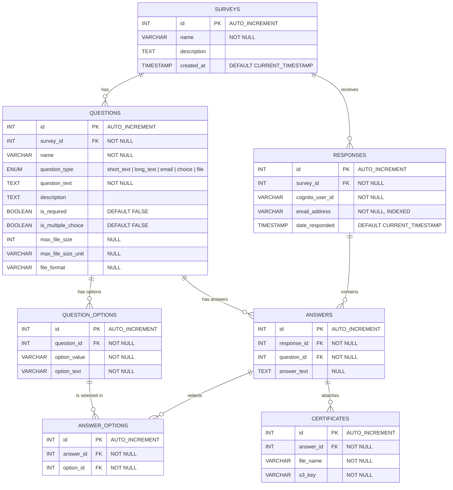

# Sky Survey Platform — Entity Relationship Diagram

```mermaid
erDiagram
    SURVEYS {
        INT id PK "AUTO_INCREMENT"
        VARCHAR name "NOT NULL"
        TEXT description
        TIMESTAMP created_at "DEFAULT CURRENT_TIMESTAMP"
    }

    QUESTIONS {
        INT id PK "AUTO_INCREMENT"
        INT survey_id FK "NOT NULL"
        VARCHAR name "NOT NULL"
        ENUM question_type "short_text | long_text | email | choice | file"
        TEXT question_text "NOT NULL"
        TEXT description
        BOOLEAN is_required "DEFAULT FALSE"
        BOOLEAN is_multiple_choice "DEFAULT FALSE"
        INT max_file_size "NULL"
        VARCHAR max_file_size_unit "NULL"
        VARCHAR file_format "NULL"
    }

    QUESTION_OPTIONS {
        INT id PK "AUTO_INCREMENT"
        INT question_id FK "NOT NULL"
        VARCHAR option_value "NOT NULL"
        VARCHAR option_text "NOT NULL"
    }

    RESPONSES {
        INT id PK "AUTO_INCREMENT"
        INT survey_id FK "NOT NULL"
        VARCHAR cognito_user_id "NOT NULL"
        VARCHAR email_address "NOT NULL, INDEXED"
        TIMESTAMP date_responded "DEFAULT CURRENT_TIMESTAMP"
    }

    ANSWERS {
        INT id PK "AUTO_INCREMENT"
        INT response_id FK "NOT NULL"
        INT question_id FK "NOT NULL"
        TEXT answer_text "NULL"
    }

    ANSWER_OPTIONS {
        INT id PK "AUTO_INCREMENT"
        INT answer_id FK "NOT NULL"
        INT option_id FK "NOT NULL"
    }

    CERTIFICATES {
        INT id PK "AUTO_INCREMENT"
        INT answer_id FK "NOT NULL"
        VARCHAR file_name "NOT NULL"
        VARCHAR s3_key "NOT NULL"
    }

    SURVEYS ||--o{ QUESTIONS : "has"
    SURVEYS ||--o{ RESPONSES : "receives"
    QUESTIONS ||--o{ QUESTION_OPTIONS : "has options"
    QUESTIONS ||--o{ ANSWERS : "has answers"
    RESPONSES ||--o{ ANSWERS : "contains"
    ANSWERS ||--o{ ANSWER_OPTIONS : "selects"
    QUESTION_OPTIONS ||--o{ ANSWER_OPTIONS : "is selected in"
    ANSWERS ||--o{ CERTIFICATES : "attaches"
```
